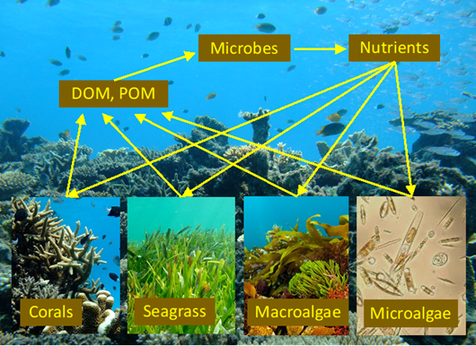

# Carbon and nitrogen cycles in coral reefs: toward linking organisms and the ecosystem

by *Yasuaki Tanaka*

Keywords: coral ecophysiology, symbiosis, stable isotope tracers, dissolved organic matter, biogeochemistry, environmental change

**Language**: English

**On-line**: Yes

**Date**: 2021/3/26 (Friday)

**Time**: 15:30-17:00

**Location**: Auditorium of the Institute of Oceanography (2nd floor), National Taiwan Universiy

