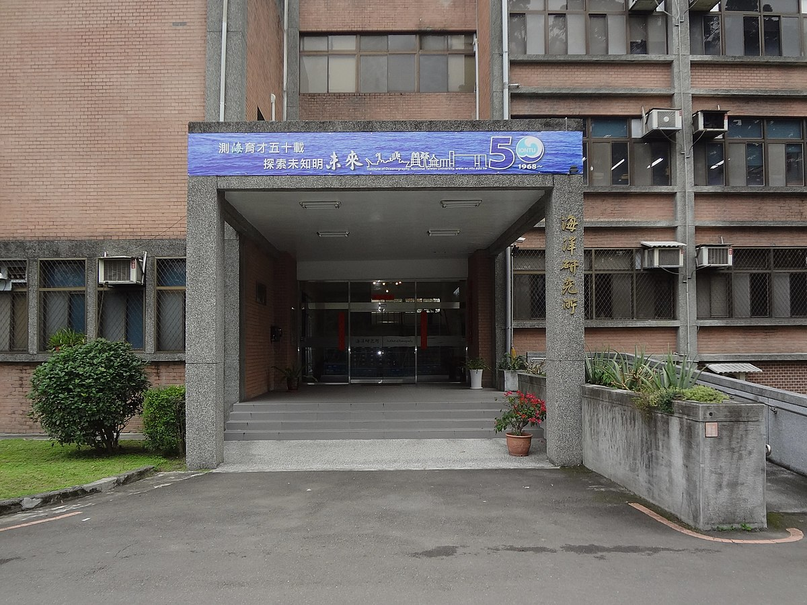

## Presentation

Funded in 1968, our institute (**IONTU**) is dedicated to interdisciplinary research and education in marine sciences. The institute is located at the northern part of NTU campus at the heart of Taipei, the capital of Taiwan. NTU is the most prestigious comprehensive university in Taiwan and one of the top-ranked universities in Asia and  the world (**[QS Global World Ranking](https://www.topuniversities.com/university-rankings/world-university-rankings/2021): 66 **). Today, NTU represnts a lively international campus, where you can enjoy your life in a friendly country inspired by a rich history and ambitions for its future. 

*Location of IONTU* 

IONTU is located at the northernmost part of the campus. It is only few hundred meters away from the sport center and directly facing the 'Moon Lake', the best location on the campus to picnic or have a break.  


```{r, echo=F, fig.cap="Interactive map of the location of IONTU"}
library(leaflet)
leaflet() %>%
  addProviderTiles(providers$Stamen.Toner) %>%
  #addTiles() %>%  # Add default OpenStreetMap map tiles
  addMarkers(lng=121.537338, lat=25.021295, popup="Institute of Oceanography")
```

## Facilities

**IONTU** has a building surface of 4,900 m^2^. It is a small four floors building composed of one lecture hall of 250 seats, two meeting roos of 50 seats, five classrooms, 29 laboratories, and an exhibition hall. The institute receives technical support from the Marine Exploration InStrument Center situated right beside IONTU


```{r, echo=FALSE, out.width="50%", fig.cap="image to replace"}

```


The institute maintains the 'Ocean Data Bank' the largest data base about marine envionment in Taiwan. IONTU manages its own research vessel 'New Ocean Researcher I' which is a ship of XX m long and XX tonnes equipped with scientific equipments such as a large ECA 800 Remotely Operated Vehicle. The ship is used for scientific research and education.

## Divisions

The institute is divided in four main divisions: **physical oceanography**, **chemical oceanography**, **marine geology and geophysics**, **marine biology and fisheries**. They directly respond to the need of interdisciplinary research in marine sciences.   

## Vision

IONTU aims to: 

+ promote cross-disciplinary, multiscale research and education in marine sciences,

+ encourage globalization by developing international research projects,

+ represents a pole of attractivity for marine research in Asia and through the word.


